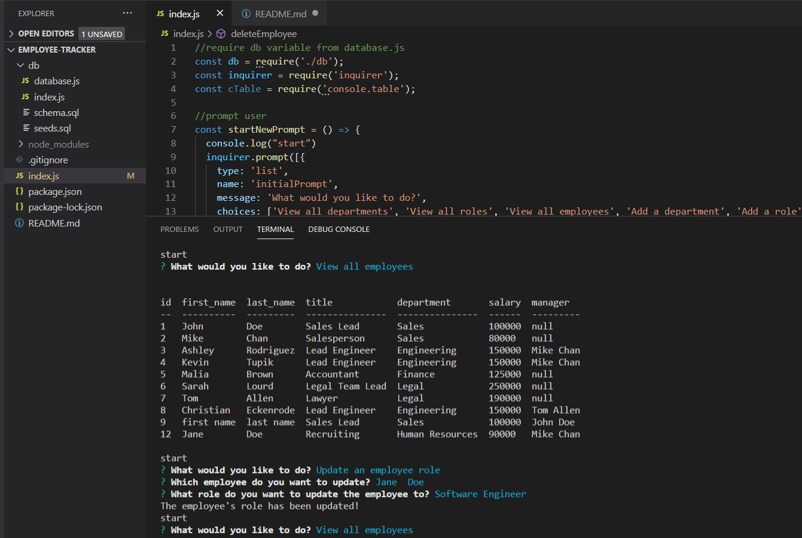

# employee-tracker

## Tutorial
https://drive.google.com/file/d/1akaFbJ3dzvyF39kYe5NTJgAXxYTHZ6E3/view

## Purpose
To provide the user with an efficient solution to view and manage a company's departments, roles, and employees by simply answering questions when prompted from the command line.

## Features
When the user calls the program, they are presented with questions regarding viewing, adding, updating, and deleting departments, roles, and employees. Viewing departments, roles, and employees consists of formatted tables presenting id's, names, and other details. Updating employees consists of selecting from a drop down of the current roles and managers. Adding departments, roles, and employees consists of test prompts and drop down lists to obtain the desired information. The user can then view their newly created elements or updates with a chained prompt.

## Built With
* JavaScript
* Node JS
* Inquirer
* MySQL

## Usage
To run program: node index

## Project Status
Employee tracker is compliant with defined acceptance criteria

## Contribution
Created by Jennifer Mulder

